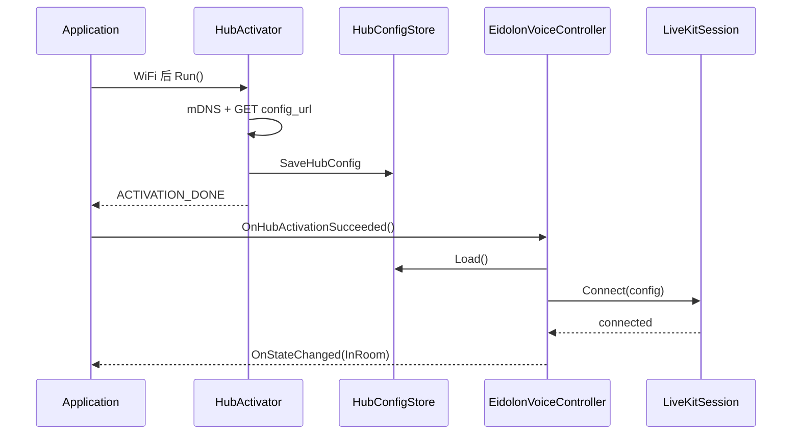

# Eidolon LiveKit 集成（ESP32）

本文档描述阶段二：在 Hub mDNS/配置拉取（阶段一）之后，使用官方 [LiveKit ESP32 SDK](https://github.com/livekit/client-sdk-esp32) 连接房间、双向 Opus 语音与可选字幕数据流。

阶段一说明见 [eidolon-hub-mdns-discovery_zh.md](eidolon-hub-mdns-discovery_zh.md)。

## 阶段范围

| 阶段 | 内容 |
|------|------|
| 阶段一 | mDNS → `GET config_url` → NVS |
| **阶段二（本文）** | `EidolonVoiceController` + `LiveKitSession` + 板级 `livekit_board` 媒体管线 |
| 阶段 2b（计划） | UI 按钮进/离房、`Manual` 策略、Hub 固件 OTA、断线退避 |

## 端到端流程

## 分层架构

| 模块 | 职责 |
|------|------|
| `HubActivator` | mDNS + HTTP + 写 NVS；**不知**是否进房 |
| `HubConfigStore` | `Save` / `Load` / `HasValidConfig` |
| `EidolonVoiceController` | 进房策略、token 刷新、对外 `JoinRoom` / `LeaveRoom` |
| `livekit_board` | I2S + ES8311/ES7210 + `esp_capture` / `av_render` |
| `LiveKitSession` | `livekit_room_*` 封装、transcription 回调 |
| `Application` | 事件转发、`DeviceState` 映射；**不直接**调 SDK room API |

## 进房策略

Kconfig：`EIDOLON_JOIN_ROOM_ON_HUB_READY`（默认 **y**）

| 策略 | 行为 |
|------|------|
| **OnHubReady**（当前） | Hub 激活成功且 NVS 有效 → 自动 `JoinRoom()` |
| **Manual**（2b） | 仅 `ConfigReady`；由 UI 调 `Application::RequestVoiceJoin()` |

对外 API（已实现）：

- `Application::RequestVoiceJoin()`
- `Application::RequestVoiceLeave()`

## Web 客户端参考（采纳 / 不采纳）

| 采纳 | 不采纳 |
|------|--------|
| Hub `/api/config` 统一 `server_url` + JWT | Web 双 env（`LIVEKIT_URL` + `TOKEN_URL`） |
| `agent_mode=streaming` | Manual/PTT + Daemon 伪 Opus |
| `transcription` data stream topic | `useVoiceAssistant` / `LiveKitRoom` React 结构 |
| connect / disconnect 生命周期语义 | 客户端随机 `room_name` |

实现真源：Hub [`config.py`](https://github.com/eidolon/eidolon_hub/blob/main/hub/api/routers/system/config.py) + SDK `custom_hardware` 示例 + 2.06 板 [`config.h`](../../main/boards/waveshare/esp32-s3-touch-amoled-2.06/config.h)。

## 音频与 I2S

- Eidolon 模式下 **不启动** `AudioService` 采集/唤醒（避免与 LiveKit `esp_capture` 争用 I2S）。
- `livekit_board` 使用 2.06 板引脚，I2S **16 kHz**（与 Hub `audio.sample_rate` 一致）。
- Opus 编解码与 WebRTC 由 LiveKit SDK 完成。

## 依赖与构建

- `main/idf_component.yml`：`livekit/livekit: "0.3.7"`（ESP32-S3/P4）
- 为兼容 LiveKit 传递依赖，项目音频组件版本与 SDK 对齐（`esp_codec_dev` ~1.4、`esp_audio_codec` ~2.3 等），见 manifest 注释。
- `sdkconfig` / `sdkconfig.defaults.esp32s3`：`CONFIG_MBEDTLS_SSL_PROTO_DTLS`、`CONFIG_MBEDTLS_SSL_DTLS_SRTP`、PSRAM 等。
- 2.06 脚本：`scripts/eidolon/eidolon-esp32-s3-touch-amoled-2.06.sh` 写入 Hub + LiveKit 相关项。
- 构建：`CONFIG_EIDOLON_HUB_MODE=y` 时编译 `main/eidolon/livekit_*.cc`、`eidolon_voice_controller.cc`。

启动时调用 `livekit_system_init()`（`Application::Initialize`）。

## 模块与文件

| 文件 | 说明 |
|------|------|
| `main/eidolon/eidolon_voice_controller.{h,cc}` | 策略与编排 |
| `main/eidolon/livekit_session.{h,cc}` | Room 连接 |
| `main/eidolon/livekit_board.{h,cc}` | 板级媒体 |
| `main/eidolon/hub_config_store.{h,cc}` | `Load()` |
| `main/eidolon/hub_config_client.cc` | `agent_mode=streaming` |
| `main/application.{h,cc}` | 集成 Controller |
| `main/Kconfig.projbuild` | `EIDOLON_JOIN_ROOM_ON_HUB_READY` 等 |

## 测试

1. `eidolon_hub/deploy/dev/run_all.sh` 启动 Hub + LiveKit。
2. 板子配网后串口：mDNS → HTTP 200 → `LiveKitSession` connecting → connected。
3. 对设备说话，确认 Agent 回复；`transcription` 可选显示在 assistant 聊天区。
4. 断网：应 `LeaveRoom` 并回到可重试状态。
5. 将 `CONFIG_EIDOLON_JOIN_ROOM_ON_HUB_READY=n` 后重编：激活后不进房，可调用 `RequestVoiceJoin()` 验证 Manual 路径。

## 变更记录

| 日期 | 摘要 |
|------|------|
| 2026-05-17 | 阶段二初版：LiveKit SDK 0.3.7、`EidolonVoiceController`、自动进房、文档落盘 |
