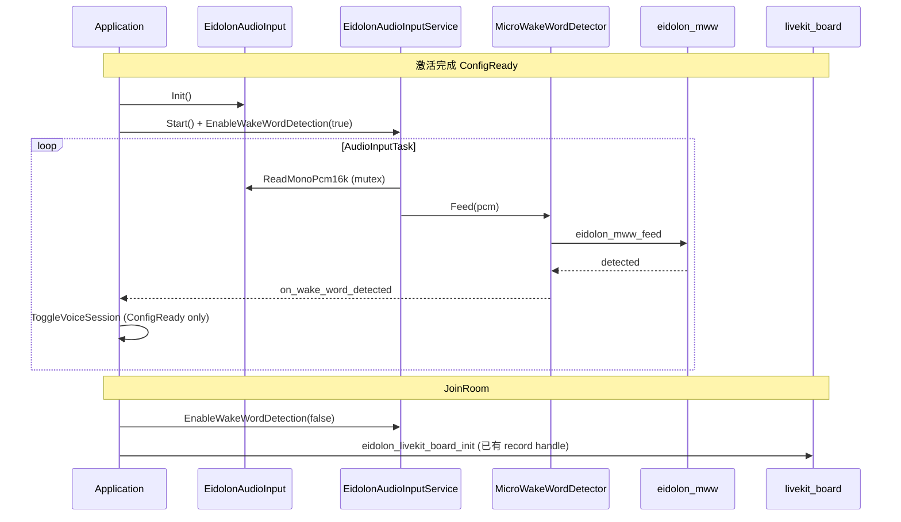

# microWakeWord 独立唤醒通路 — 实现说明

本文档记录 **已落地代码** 与方案 [micro-wake-word-plan_zh.md](micro-wake-word-plan_zh.md) 的对应关系。操作说明见 [wake-word-micro_zh.md](wake-word-micro_zh.md)。

## 与方案差异

| 方案 | 实际实现 | 原因 |
|------|----------|------|
| 独立组件 `components/eidolon_micro_wake_word/` | 推理代码在 `main/eidolon/wake_word/` | 项目 `MINIMAL_BUILD` 下本地组件依赖不易进 main 链接图 |
| `EIDOLON_WAKE_WORD_THRESHOLD` 默认 22 | 默认 **128**（≈0.5，与 ESPHome `hey_jarvis` 配置一致） | 与上游模型 JSON 对齐，联调可改 |

其余阶段（统一 codec、瘦身输入服务、Application 挂钩、Hub 不编乐鑫 wake_word、专用分区）均按方案完成。

## 目录与文件

```
main/eidolon/
├── eidolon_audio_input.{h,cc}          # Phase 1：BoxAudioCodec 薄封装 + mutex
├── audio/
│   ├── eidolon_wake_word_detector.h    # 检测器接口（无 srmodel / Opus）
│   ├── eidolon_audio_input_service.{h,cc}  # Phase 3：瘦身 AudioInputTask
├── wake_word/
│   ├── eidolon_mww.{h,cpp}             # Phase 2：TFLite + microfrontend 推理
│   ├── micro_wake_word_detector.{h,cc} # Phase 3：EidolonWakeWordDetector 实现
│   ├── models/hey_jarvis.tflite        # 嵌入 flash（EMBED_FILES）
│   └── tensorflow/lite/experimental/microfrontend/lib/  # vendored 预处理（TF v2.18 + kissfft）
├── livekit_board.cc                    # Phase 1：复用 codec handle，无二次 I2S init

main/audio/codecs/box_audio_codec.h     # GetInputDeviceHandle / GetDataIfMutex
main/application.{h,cc}                 # Phase 4：StartEidolonWakeWord / OnEidolonVoiceSessionState
main/audio/audio_service.cc             # Hub：SetModelsList 不创建乐鑫 WakeWord
main/CMakeLists.txt                     # Hub 源列表 + 精简 microfrontend 源
main/Kconfig.projbuild                  # EIDOLON_WAKE_WORD_*
main/idf_component.yml                  # espressif/esp-tflite-micro

partitions/v2/16m_eidolon.csv           # OTA 0x420000，assets 0x860000
scripts/eidolon/eidolon-esp32-s3-touch-amoled-2.06.sh  # 分区 + WAKE_WORD_DISABLED
docs/eidolon/wake-word-micro_zh.md
```

## 数据流



## 构建要点

- **Kconfig**（`CONFIG_EIDOLON_HUB_MODE` + `CONFIG_EIDOLON_WAKE_WORD_ENABLE`）：
  - 追加 `eidolon_audio_input_service.cc`、`micro_wake_word_detector.cc`、`eidolon_mww.cpp` 及列出的 microfrontend `.c/.cc`。
  - **不编译** `audio/wake_words/afe_wake_word.cc` 等（`NOT CONFIG_EIDOLON_HUB_MODE`）。
- **依赖**：`PRIV_REQUIRES espressif__esp-tflite-micro`。
- **嵌入**：`eidolon/wake_word/models/hey_jarvis.tflite`。
- **分区**：Eidolon 脚本写入 `CONFIG_PARTITION_TABLE_CUSTOM_FILENAME="partitions/v2/16m_eidolon.csv"`。
- **体积**（参考）：`eidolon.bin` ≈ 4.0 MB，OTA 分区约 **4%** 余量（需完整烧录 partition table）。

## 上游许可

- 模型：[esphome/micro-wake-word-models](https://github.com/esphome/micro-wake-word-models)（Apache-2.0）
- 推理逻辑参考：[ESPHome micro_wake_word](https://github.com/esphome/esphome/tree/dev/esphome/components/micro_wake_word)
- microfrontend：TensorFlow v2.18 `tensorflow/lite/experimental/microfrontend`

## 相关文档

- [micro-wake-word-plan_zh.md](micro-wake-word-plan_zh.md) — 方案
- [wake-word-micro_zh.md](wake-word-micro_zh.md) — 使用、调参、验收
- [livekit-integration_zh.md](livekit-integration_zh.md) — LiveKit 进房（与唤醒并列入口）
