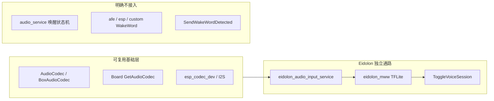
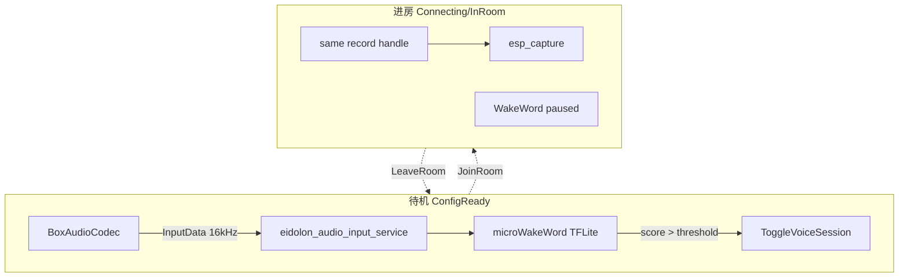

# microWakeWord 独立唤醒通路 — 方案说明

本文档为 Eidolon Hub（Waveshare ESP32-S3-Touch-AMOLED-2.06）引入 **microWakeWord** 的设计方案摘要。实现落点见 [micro-wake-word-implementation_zh.md](micro-wake-word-implementation_zh.md)；使用与验收见 [wake-word-micro_zh.md](wake-word-micro_zh.md)。

## 目标

在 Hub 固件中增加 **独立于小智/乐鑫 SR** 的唤醒通路：预训练 **hey jarvis**，唤醒后调用 `Application::ToggleVoiceSession()`，与触屏、BOOT 短按并列进房。

## 「解耦」含义

**解耦** = 不走小智唤醒产品路径与乐鑫 **WakeNet / Multinet / esp_srmodel**，而不是禁止使用仓库内一切 audio 代码。

| 做 | 不做 |
|----|------|
| fork `eidolon_audio_input_service` + `MicroWakeWordDetector` + TFLite | 不实例化 Afe/Esp/Custom WakeWord |
| 复用 `BoxAudioCodec` + 瘦身输入状态机 | 不启动完整 `audio_service_`、不走 `HandleWakeWordDetectedEvent` |
| 预训练 hey_jarvis 联调 | 不进房不走乐鑫 SR；v1 不做中文自训 |
| 唤醒 → `ToggleVoiceSession()` | 不调用 `SendWakeWordDetected` |

## 架构（待机 / 进房）

## 实现阶段（计划）

### Phase 1 — 统一音频硬件

- 新增 `eidolon_audio_input`：持有 `AudioCodec*`，`Init()`、`ReadMonoPcm16k()`、mutex。
- `BoxAudioCodec` 暴露 `GetInputDeviceHandle()` 等供 LiveKit。
- 重构 `livekit_board`：删除重复 I2S/ES8311/ES7210，绑定已有 record/play handle。
- 启动时机：`HandleActivationDoneEvent` → `eidolon_audio_input.Init()` → 唤醒 `Start()`。

### Phase 2 — microWakeWord 推理

- 依赖 `espressif/esp-tflite-micro`。
- 特征：TensorFlow microfrontend（10 ms stride → 40 维）。
- 模型：`hey_jarvis.tflite` 嵌入 flash；tensor arena 使用 PSRAM。

### Phase 3 — 输入状态机 + 检测器

- `eidolon_audio_input_service`：自 `audio_service` 瘦身，仅保留采麦 + `EnableWakeWordDetection`。
- `MicroWakeWordDetector`：实现 `EidolonWakeWordDetector`，内部 `eidolon_mww_*`。
- 进房暂停唤醒，离房恢复；2 s cooldown。

### Phase 4 — Application 挂钩

- `on_wake_word_detected` → 仅 `ConfigReady` 时 `Schedule(ToggleVoiceSession)`。
- `OnEidolonVoiceSessionState`：Connecting/InRoom 关检测，ConfigReady 开检测。

### Phase 5 — Kconfig / 构建

- `EIDOLON_WAKE_WORD_ENABLE` / `THRESHOLD` / `COOLDOWN_MS`。
- Hub 不编译 `afe_wake_word.cc` 等；脚本 `CONFIG_WAKE_WORD_DISABLED=y`。
- 分区 `16m_eidolon.csv`（OTA 略大于默认 `16m.csv`）。

### Phase 6 — 文档与验收

见 [wake-word-micro_zh.md](wake-word-micro_zh.md) 验收表。

## FAQ 摘要

**Q1：能否复用 `audio_service` 唤醒状态机？**  
模式可复用；整份 `audio_service` 不宜在 Hub 启用。采用 **复制 + 瘦身 + 改名** → `eidolon_audio_input_service`。

**Q2：afe / esp / custom 是什么？**  
乐鑫 ESP-SR 的三种 `WakeWord` 后端，不能加载 `.tflite`。Eidolon 新增第四种：`MicroWakeWordDetector`（不在 `main/audio/wake_words/`）。

## 风险与缓解

| 风险 | 缓解 |
|------|------|
| I2S 与 LiveKit 争用 | 单一 `BoxAudioCodec` + mutex；进房暂停唤醒 |
| Flash/PSRAM 增大 | 单模型 hey_jarvis；`idf.py size`；专用 OTA 分区 |
| 英文模型误/漏触发 | 调 `THRESHOLD`；文档说明 v1 为英文联调 |

## 后续（计划外）

- 第二模型（如 okay_nabu）Kconfig 选型
- OHF 自训中文词并替换 `.tflite`
- Hub 构建精简 `generated_assets.bin` 中的 esp-sr wakenet（需验证 LiveKit 依赖）
